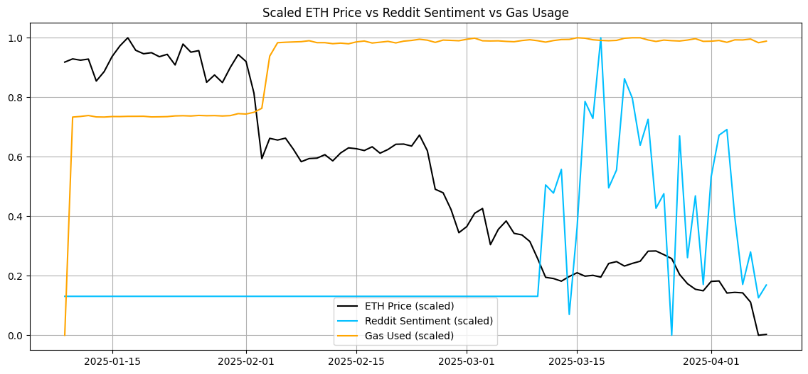

# ETH Price Prediction with Reddit Sentiment + On-Chain Activity

This project explores the predictive relationship between **Ethereum's price**, **Reddit sentiment**, and **on-chain activity metrics** (from Dune). The goal was to test whether social + blockchain signals can forecast ETH price movement.

---

## Key Insights

- **Reddit sentiment is not a bullish signal** — it often reflects **lagging optimism** after price drops.
- **High gas usage may signal network stress or hype peaks**, which tend to **precede pullbacks**.
- **Trading volume has mild predictive value**, but needs context (e.g. volatility, order flow).
- A **simple regression model** using 3 features explained **71% of ETH price variance (R² = 0.71)**.

---

## Data Pipeline

- **ETH Price**: [CoinGecko API](https://www.coingecko.com/en/api)
- **Reddit Posts**: [PRAW API](https://praw.readthedocs.io/) + VADER Sentiment
- **On-Chain Activity**: Dune SQL queries using:
  - Whale transfers > 100 ETH  
  - Uniswap v3 swaps  
  - Gas usage

---

## Visual Summary

---

## Project Structure

